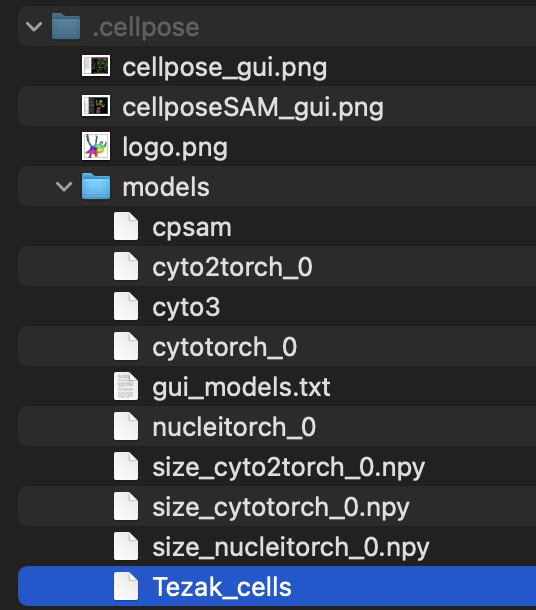

# Tezak Lab - Cell Counter

## Contributors:
alenachen2 - Alena Chen  
schalla1201 - Saakshi Challa  
acurielwes - Allegra Curiel  

## User Instructions
1. Download Python version 3.11._x_ if it is not already downloaded by following the instructions from this link: https://www.python.org/downloads/. To check your Python version, type ```python --version``` into the terminal.   
2. Clone our Github repository  
   - Open Terminal on your laptop and type: git clone https://github.com/alenachen2/COMP333-Tezak.git  
   - Change directory into our repository's folder by figuring out where the repository was downloaded and then typing: ```cd COMP333-Tezak```.  
3. Create a virtual environment for this project.   
   - Type ```python3.11 -m venv cellpose_env``` to create a virtual environment named cellpose_env.  
   - To activate the virtual environment on macOS/Linux, type ```source cellpose_env/bin/activate```. If you are using Windows, type ```cellpose_env\Scripts\activate```  
4. Install required Python Packages.  
   - In the terminal, type ```pip3 install opencv-python yaspin 'cellpose[gui] == 4.0.7' numpy matplotlib pytest```  
   - If this doesn't work, try   
   ```python -m pip install -U pip wheel setuptools```  
   ```python -m pip install --only-binary=:all: "opencv-python-headless==4.10.0.84"```  
5. Install the Tezak model by downloading this file to your computer: https://drive.google.com/drive/folders/1nwvbcopUyeYl0rTC6b3WTA5n06dgkSJR?usp=sharing
   - Unzip the folder, and then add this model to the cellpose models folder.  
      - On a macOS, do this by opening Finder, going to your user folder, and pressing ```Cmd + Shift + .```. Look for the ```.cellpose``` folder. Within this, there should be a ```models``` folder. Move the Tezak file you just downloaded into this models folder.  
        

      - On a Windows computer, do this by opening File Explorer and going to your user folder. Click ```View``` (or ```View -> Show``` on Windows 11). Check Hidden items. Look for the ```.cellpose``` folder. Within this, there should be a ```models``` folder. Move the Tezak file you just downloaded into this models folder. 
      - On a Linux computer, open File Manager and go to your Home directory. Press ```Ctrl + H```. Look for the ```.cellpose``` folder. Within this, there should be a ```models``` folder. Move the Tezak file you just downloaded into this models folder. 
6. To use our user interface, run our code by typing ```python gui.py``` in the terminal. (If you want to use the command line interface, follow the instructions in the next section.) A pop-up screen should appear. Upload an image from your computer using the "Upload Images" button. When done uploading images, click the "Run Cell Counter" button. Be advised that cell counting may take anywhere up to five minutes per image.    
   - To run multiple images at once, select all images at once and upload them together. Use the "Next" and "Previous" buttons to toggle between images.
      - On a Mac, click on the Command button each time a new image is selected to be added.
      - On a Windows computer, click on the Control (Ctrl) button each time a new image is selected to be added.
7. To run our test code, type: ```pytest```. 
   - If you are unfamilar with pytest, here is documentation explaining how it works: https://docs.pytest.org/en/stable/.

### Using the command line interface 
After step 4: 
Run our code by typing ```python main.py```. Be advised that cell counting may take anywhere up to five minutes.  
   - When prompted to insert a file path, you may use your own cell image, or one of the cell images provided to us by the Tezak Lab. Since our code is tailored to work with specific cell images and still in the works, there is no guarantee of the cell count accuracy with other cell images.   
    - To use our images, locate the images folder and find an image you would like to test, named x.jpg, where x is an image. The path would be ```images/x.jpg```.  
    - To use your own image, find where the image is saved on your computer and insert the file's path.   
 

